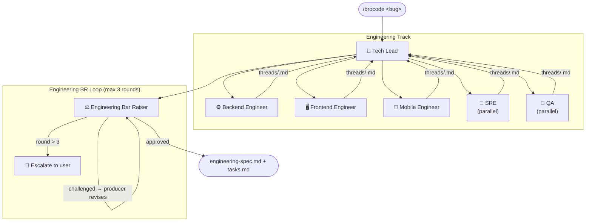
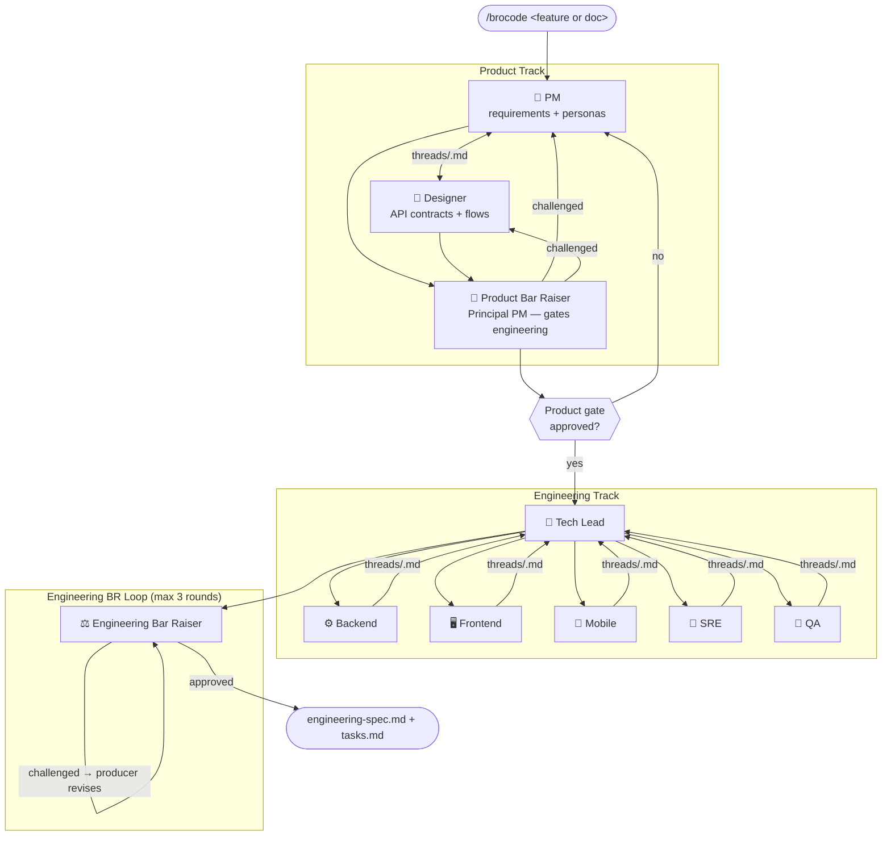
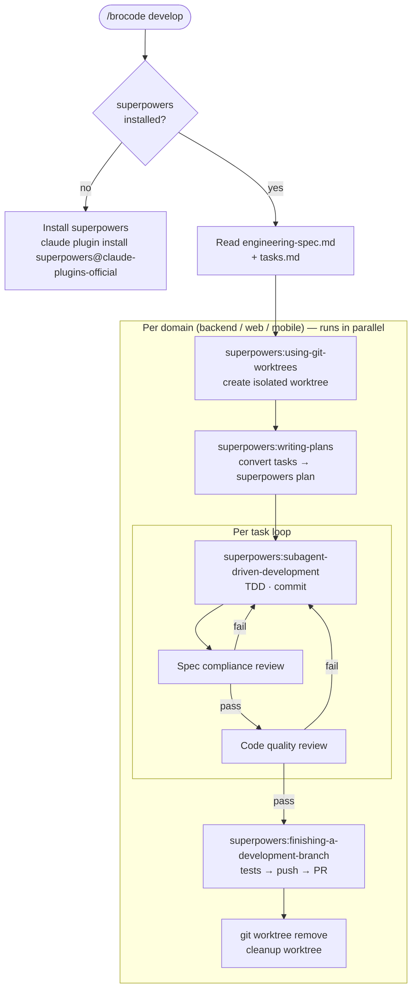
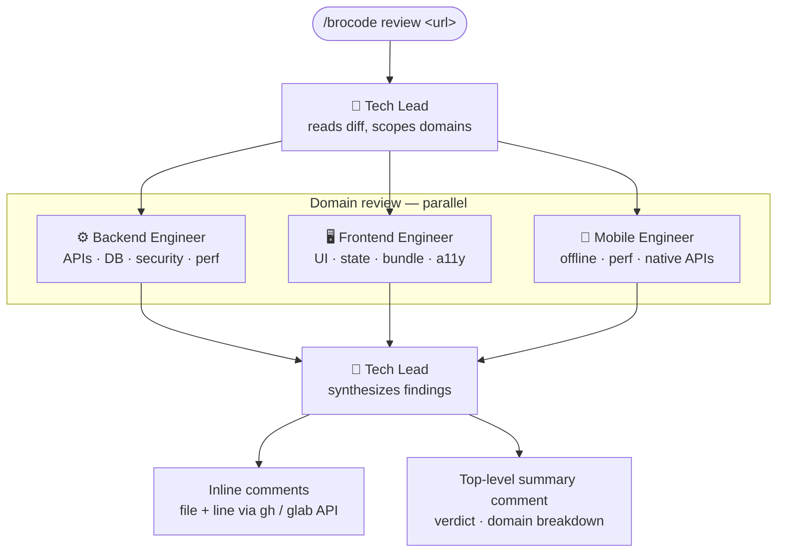
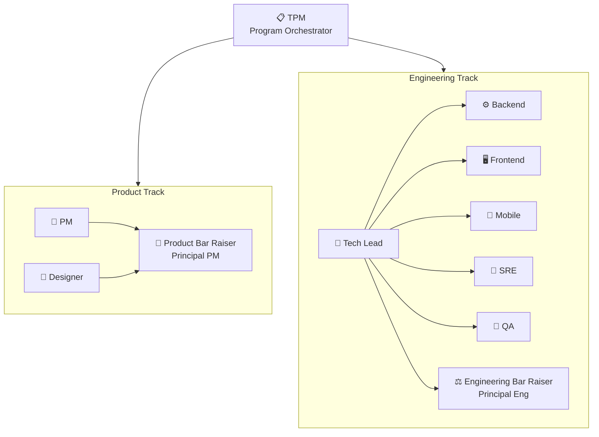
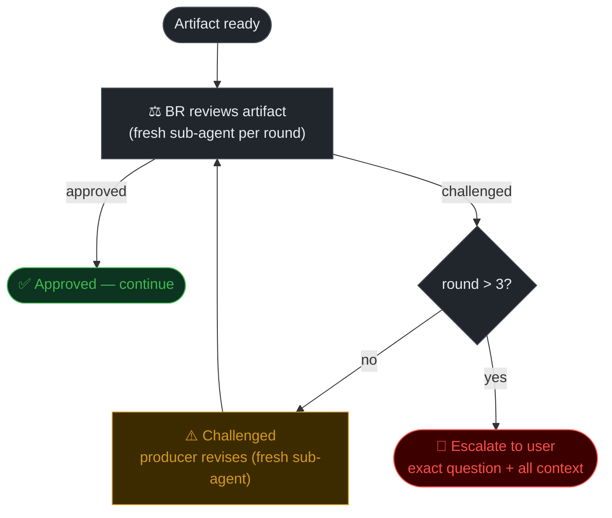

# brocode

Multi-agent SDLC plugin for Claude Code. One command. Full engineering org in your terminal.

Paste a bug report, feature idea, PRD, doc link, or screenshot. Type `/brocode`. The right agents spin up, debate, challenge each other through adversarial review loops, and produce a final approved spec or investigation report — no manual orchestration needed.

---

## Install

```bash
# 1. Clone brocode
git clone https://github.com/im-adarsh/brocode.git ~/brocode

# 2. Register with Claude Code
claude plugin marketplace add ~/brocode

# 3. Install brocode
claude plugin install brocode@brocode-local --scope user

# 4. Install superpowers (required for /brocode develop and /brocode review)
claude plugin install superpowers@claude-plugins-official --scope user
```

Restart Claude Code after install. Then `/brocode:brocode` is available — type `/broc` and select it from autocomplete.

> **Updating:** `cd ~/brocode && git pull` — no reinstall needed.
>
> **Migrating from old `sdlc` install:** `claude plugin uninstall sdlc@brocode-local` then reinstall as above.

---

## Usage

```
/brocode <anything>
```

No flags. No mode selection. brocode reads context and routes automatically.

### Examples

```
/brocode  users are getting 500 errors on checkout after the deploy at 3pm
/brocode  I want to add SSO login with Google OAuth to our app
/brocode  [attach screenshot of Figma mockup]
/brocode  [paste Google Doc link with PRD]
/brocode  why does the payment webhook fail intermittently on retries?
/brocode  develop
/brocode  review https://github.com/org/repo/pull/42
```

### Register your repos

Engineer agents read real code. Tell them where to find it:

```
/brocode:brocode repos
```

Any domain, any number of repos per domain. You'll be prompted for a description, labels, and tags per repo so agents know what each one does:

```
backend: /path/to/api           → "Main REST API — billing and accounts"  labels: api,billing  tags: node,postgres
backend: /path/to/auth-service  → "Auth service"                          labels: auth         tags: go,redis
mobile: /path/to/ios            → "iOS app (Swift/SwiftUI)"               labels: ios          tags: swift
web: /path/to/frontend          → "React web app"                                              tags: react,ts
```

Saves to `~/.brocode/repos.json` — shared across all projects on this machine. Run once per machine, update anytime.

---

## How it works

brocode has three modes. It picks the right one automatically.

---

### Mode 1: Investigate — Bug / Incident / Oncall

Triggered by: bug reports, errors, crashes, test failures, production incidents.



**What you get:** Root cause confirmed with evidence, exact code fix, failing test that proves the bug, ops impact, rollback plan, domain-scoped task list.

---

### Mode 2: Spec — Feature / System Design

Triggered by: feature requests, design tasks, PRDs, doc/image input.



**What you get:** Approved requirements, API contracts, 3 impl options with recommendation, architecture review, ops plan with rollback, full test matrix. Challenged and signed off by two bar raisers.

---

### Mode 3: Develop — Implement the spec

Triggered by: `/brocode develop` after a spec is approved.



**What you get:** One PR per domain, all tasks implemented with TDD, two-stage review per task (spec compliance + code quality), tests passing, worktree cleaned up after each PR.

---

### Mode 4: Review — Code review a PR or MR

Triggered by: `/brocode review <github-or-gitlab-url>`



**What you get:** Inline comments on every finding at the exact file+line, posted directly to the GitHub PR or GitLab MR. Top-level summary with APPROVE / REQUEST_CHANGES verdict and domain breakdown.

---

## The org



| Agent | Role | Produces |
|-------|------|---------|
| **TPM** | Program orchestrator, logs all transitions, prints live progress | `tpm-logs.md` |
| **PM** | Senior Product Manager | `product-spec.md` |
| **Designer** | Senior Designer (UX / UI) | `ux.md` |
| **Product Bar Raiser** | Principal PM — challenges PM + Designer, gates engineering | Challenge files + gate approval |
| **Tech Lead** | Owns engineering team, dispatches sub-agents, synthesizes debate | `investigation.md` or `implementation-options.md` |
| → **Backend Engineer** *(sub-agent)* | APIs, DB, services, queues | Threads in `threads/<topic>.md` |
| → **Frontend Engineer** *(sub-agent)* | Web UI, state, browser, SSR/CSR | Threads in `threads/<topic>.md` |
| → **Mobile Engineer** *(sub-agent)* | iOS, Android, RN, Flutter, offline | Threads in `threads/<topic>.md` |
| → **SRE** *(sub-agent)* | Ops plan, blast radius, rollback | `ops.md` |
| → **QA** *(sub-agent)* | Full test matrix with actual test code | `test-cases.md` |
| **Engineering Bar Raiser** | Principal Eng — challenges Tech Lead artifacts, final gate | Challenge files + gate approval |

---

## Bar Raiser loops

Bar Raisers run adversarial review loops. Challenges are blockers, not suggestions.



**Product Bar Raiser** (Principal PM):
- Challenges requirements: missing personas, untestable ACs, unresolved assumptions
- Challenges design: missing error states, undefined API contracts, missing ops/support interfaces
- Uses web search to verify competitor claims
- Hard gate: engineering cannot start until both PM + Designer approved

**Engineering Bar Raiser** (Principal Engineer):
- Challenges Tech Lead on implementation options: vague tradeoffs, inconsistency with design
- Challenges Tech Lead on ops plan (SRE findings): theoretical rollback, missing observability
- Challenges Tech Lead on test coverage (QA findings): ACs without tests, TODOs instead of test code
- Cross-checks all artifacts for consistency
- Tech Lead is sole interface — SRE and QA never receive BR challenges directly

---

## Terminal progress

TPM prints a live status line at every agent transition:

```
📋  TPM          →  kicked off spec-20260426-oauth, logging stages
🎯  PM           →  reading brief, building requirements
🎯  PM      ↔️  🎨  Designer    →  PM asked: "empty state for first-time users?"
🎨  Designer      →  writing API contracts and user flows
🔬  Product BR    →  challenging PM requirements (round 1)
⚠️  Product BR    →  found gap: ops interface missing — routing back to PM
✅  Product BR    →  requirements APPROVED — product gate OPEN
🤝  Tech Lead     →  dispatching Backend + Frontend in parallel
⚙️  Backend  ↔️  🖥️  Frontend   →  Backend: "3 round-trips for one screen"
⚠️  Eng BR       →  challenged Tech Lead: "option 3 has N+1 query" (round 1)
✅  Eng BR       →  all artifacts APPROVED
📋  TPM          →  final spec + tasks written — done
```

Prefixes: `⚠️` BR challenge · `✅` approved · `🚫` blocked waiting on you

---

## Agent conversations

Agents talk to each other. All exchanges logged in thread files.

| Thread | Who talks |
|--------|-----------|
| `threads/<topic>.md` | Created on demand per discussion topic |
| `threads/product-conversation.md` | PM ↔ Designer (default) |
| `threads/swe-debate.md` | Backend ↔ Frontend ↔ Mobile (default) |
| `threads/eng-conversation.md` | Tech Lead ↔ SRE ↔ QA (default) |

---

## Context directory

```mermaid
graph TD
    ROOT[".brocode/spec-20260426-oauth/"]:::dir

    ROOT --> TPM["📋 tpm-logs.md — TPM master log, live"]:::tpm
    ROOT --> BRIEF["brief.md — user input + clarified scope"]:::file
    ROOT --> REQ["product-spec.md — PM, versioned"]:::file
    ROOT --> DES["ux.md — Designer, versioned"]:::file
    ROOT --> IMPL["implementation-options.md / investigation.md — Tech Lead"]:::file
    ROOT --> OPS["ops.md — SRE, versioned"]:::file
    ROOT --> QA["test-cases.md — QA, versioned"]:::file
    ROOT --> THR["threads/"]:::dir
    THR --> PCT["&lt;topic&gt;.md — created on demand per discussion"]:::thread
    THR --> ENGP["eng-product-conversation.md — Eng ↔ PM/Designer"]:::thread
    ROOT --> PBR["br/product/ — challenge rounds + gate approval"]:::br
    ROOT --> EBR["br/engineering/ — challenge rounds + approvals"]:::br
    ROOT --> SPEC["✅ engineering-spec.md — approved, ready to implement"]:::final
    ROOT --> TASKS["✅ tasks.md — domain-scoped tasks for /brocode develop"]:::final
    ROOT --> INST["instructions/ — TPM writes before each dispatch"]:::dir
    ROOT --> RETRO["brocode.md — post-run retrospective"]:::file

    classDef dir fill:#1a3a5c,stroke:#58a6ff,color:#58a6ff
    classDef tpm fill:#0d3321,stroke:#3fb950,color:#3fb950
    classDef file fill:#21262d,stroke:#484f58,color:#e6edf3
    classDef thread fill:#2a1a4a,stroke:#bc8cff,color:#bc8cff
    classDef br fill:#3d2b00,stroke:#d29922,color:#d29922
    classDef final fill:#0d3321,stroke:#3fb950,color:#3fb950
```

Every `/brocode` run creates `.brocode/<id>/`:



`.brocode/` is gitignored.

---

## Repo config

```
/brocode repos
```

Prompts for paths, description, labels, and tags per repo. Writes to `~/.brocode/repos.json` (user-level, shared across all projects):

```json
{
  "backend": [
    {
      "path": "/absolute/path/to/api",
      "description": "Main REST API handling user accounts and billing",
      "labels": ["api", "billing"],
      "tags": ["node", "express", "postgres"]
    }
  ],
  "web": [
    {
      "path": "/absolute/path/to/frontend",
      "description": "React web app",
      "labels": [],
      "tags": ["react", "typescript"]
    }
  ]
}
```

Agents read `description`, `labels`, and `tags` to orient themselves before exploring code. If a path isn't set, that engineer agent notes it and skips code reading. No silent failures.

---

## Knowledge base

Engineer sub-agents scan registered repos on first use and cache findings to `~/.brocode/wiki/`. Compounds across all brocode runs.

```
~/.brocode/wiki/
  index.md            ← all repos scanned, global TOC
  log.md              ← scan history
  <repo-slug>/
    overview.md       ← pattern, stack, CI
    patterns.md       ← layout, service boundaries, naming
    conventions.md    ← from CLAUDE.md + observed patterns
    dependencies.md   ← deps, external services
    test-strategy.md  ← test runner, file locations
```

Re-scanned automatically if > 7 days old. No manual action needed.

---

## Input formats

| Input | How brocode handles it |
|-------|----------------------|
| Plain text | Used directly by PM |
| Attached image / screenshot | PM and Designer analyze via vision |
| Google Doc URL | Fetched via Google Drive MCP (if connected) |
| Notion / Confluence URL | Ask user to paste |
| Figma URL | Ask user to export PNG |

---

## File structure

```
brocode/
  .claude-plugin/
    plugin.json              # Plugin manifest (v0.2.0)
    marketplace.json
  agents/
    tpm.md                   # TPM
    pm.md
    designer.md
    product-bar-raiser.md
    tech-lead.md             # Tech Lead (owns engineering team)
    swe-backend.md           # Backend sub-agent
    swe-frontend.md          # Frontend sub-agent
    swe-mobile.md            # Mobile sub-agent
    sre.md
    qa.md
    engineering-bar-raiser.md
  commands/
    brocode.md               # /brocode:brocode — full orchestration
  docs/
    index.html               # GitHub Pages site
  CLAUDE.md
  README.md
```

---

## Extending brocode

### Add a new agent role

1. Create `agents/<role>.md`
2. Add to `commands/brocode.md` at the right phase
3. Update `CLAUDE.md` roster table

### Modify Bar Raiser challenge standards

- Product BR: `agents/product-bar-raiser.md` → "What You Look For"
- Engineering BR: `agents/engineering-bar-raiser.md` → "What You Look For"

---

## License

MIT
