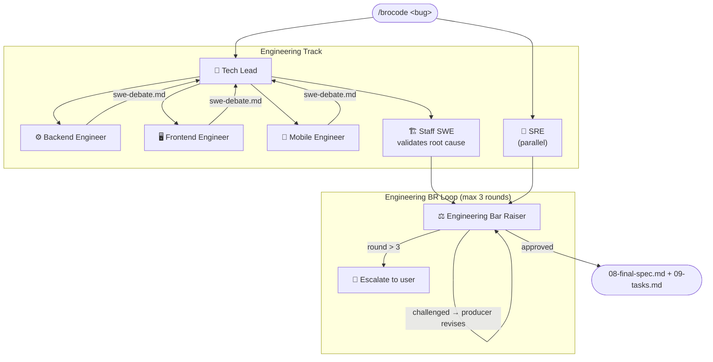
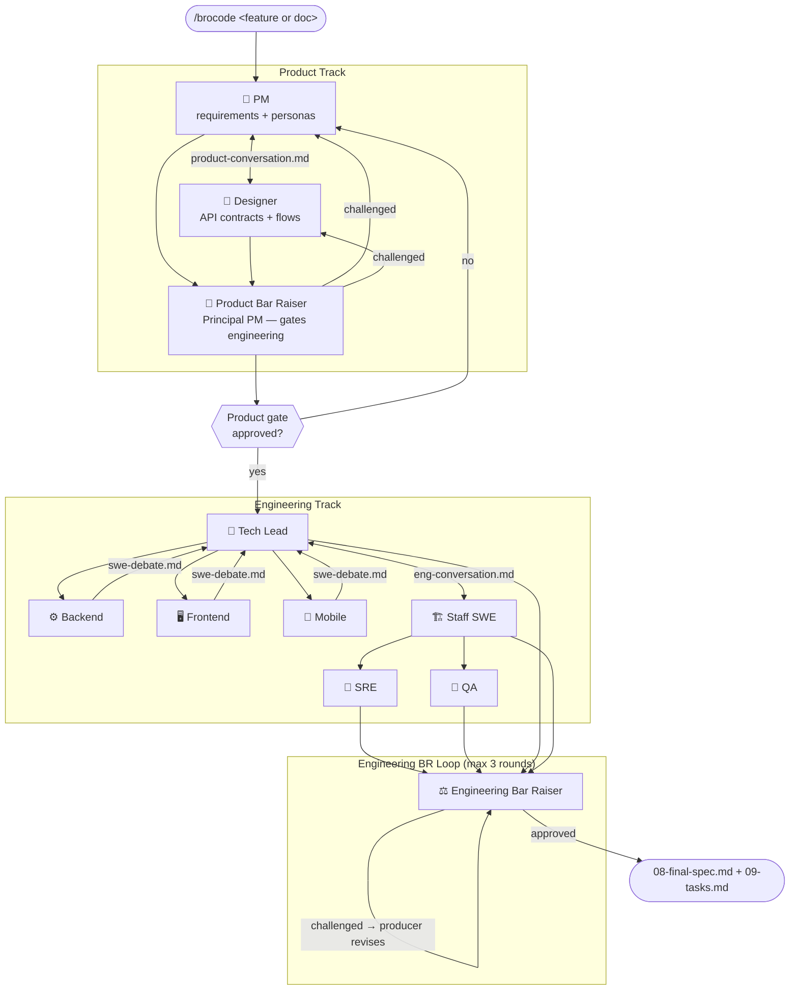
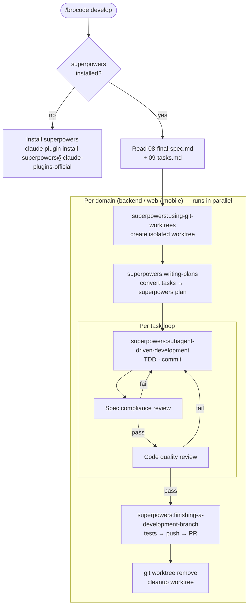
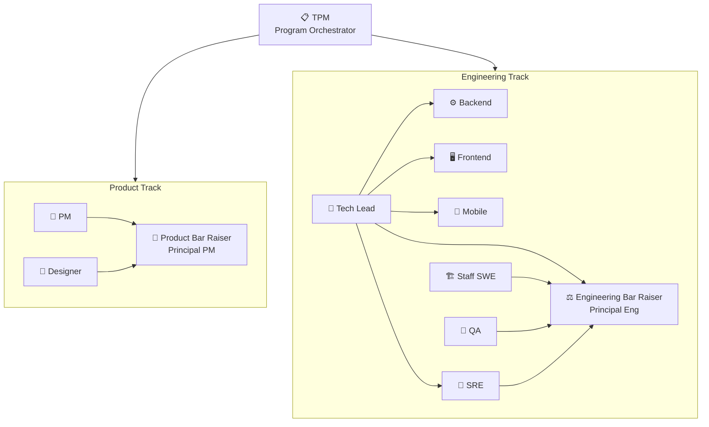

# brocode

Multi-agent SDLC plugin for Claude Code. One command. Full engineering org in your terminal.

Paste a bug report, feature idea, PRD, doc link, or screenshot. Type `/brocode`. The right agents spin up, debate, challenge each other through adversarial review loops, and produce a final approved spec or investigation report — no manual orchestration needed.

---

## Install

```bash
# 1. Clone brocode
git clone https://github.com/im-adarsh/brocode.git ~/brocode

# 2. Register with Claude Code
claude plugin marketplace add ~/brocode

# 3. Install brocode
claude plugin install brocode@brocode-local --scope user

# 4. Install superpowers (required for /brocode develop and /brocode review)
claude plugin install superpowers@claude-plugins-official --scope user
```

Restart Claude Code after install. Then `/brocode:brocode` is available — type `/broc` and select it from autocomplete.

> **Updating:** `cd ~/brocode && git pull` — no reinstall needed.
>
> **Migrating from old `sdlc` install:** `claude plugin uninstall sdlc@brocode-local` then reinstall as above.

---

## Usage

```
/brocode <anything>
```

No flags. No mode selection. brocode reads context and routes automatically.

### Examples

```
/brocode  users are getting 500 errors on checkout after the deploy at 3pm
/brocode  I want to add SSO login with Google OAuth to our app
/brocode  [attach screenshot of Figma mockup]
/brocode  [paste Google Doc link with PRD]
/brocode  why does the payment webhook fail intermittently on retries?
/brocode  develop
/brocode  review https://github.com/org/repo/pull/42
```

### Register your repos

Engineer agents read real code. Tell them where to find it:

```
/brocode:brocode repos
```

Any domain, any number of repos per domain:

```
backend: /path/to/api
backend: /path/to/auth-service
mobile: /path/to/ios
mobile: /path/to/android
web: /path/to/frontend
terraform: /path/to/infra
qa: /path/to/test-suite
```

Saves to `.brocode-repos.json` (gitignored). Run once per machine, update anytime.

---

## How it works

brocode has three modes. It picks the right one automatically.

---

### Mode 1: Investigate — Bug / Incident / Oncall

Triggered by: bug reports, errors, crashes, test failures, production incidents.



**What you get:** Root cause confirmed with evidence, exact code fix, failing test that proves the bug, ops impact, rollback plan, domain-scoped task list.

---

### Mode 2: Spec — Feature / System Design

Triggered by: feature requests, design tasks, PRDs, doc/image input.



**What you get:** Approved requirements, API contracts, 3 impl options with recommendation, architecture review, ops plan with rollback, full test matrix. Challenged and signed off by two bar raisers.

---

### Mode 3: Develop — Implement the spec

Triggered by: `/brocode develop` after a spec is approved.



**What you get:** One PR per domain, all tasks implemented with TDD, two-stage review per task (spec compliance + code quality), tests passing, worktree cleaned up after each PR.

---

### Mode 4: Review — Code review a PR or MR

Triggered by: `/brocode review <github-or-gitlab-url>`


**What you get:** Inline comments on every finding at the exact file+line, posted directly to the GitHub PR or GitLab MR. Top-level summary with APPROVE / REQUEST_CHANGES verdict and domain breakdown.

---

## The org



| Agent | Role | Produces |
|-------|------|---------|
| **TPM** | Program orchestrator, logs all transitions, prints live progress | `00-tpm-log.md` |
| **PM** | Senior Product Manager | `01-requirements.md` |
| **Designer** | Senior Designer (API + UX) | `02-design.md` |
| **Product Bar Raiser** | Principal PM — challenges PM + Designer, gates engineering | Challenge files + gate approval |
| **Tech Lead** | Owns engineering team, dispatches sub-agents, synthesizes debate | `03-investigation.md` or `03-implementation-options.md` |
| → **Backend Engineer** *(sub-agent)* | APIs, DB, services, queues | Debate in `swe-debate.md` |
| → **Frontend Engineer** *(sub-agent)* | Web UI, state, browser, SSR/CSR | Debate in `swe-debate.md` |
| → **Mobile Engineer** *(sub-agent)* | iOS, Android, RN, Flutter, offline | Debate in `swe-debate.md` |
| → **SRE** *(Tech Lead's team)* | Ops plan, blast radius, rollback | `05-ops.md` |
| **Staff SWE** | Architecture review, peer to Tech Lead | `04-architecture.md` |
| **QA** | Full test matrix with actual test code | `06-test-cases.md` |
| **Engineering Bar Raiser** | Principal Eng — challenges all 4 artifacts, writes final spec | `08-final-spec.md` + `09-tasks.md` |

---

## Bar Raiser loops

Bar Raisers run adversarial review loops. Challenges are blockers, not suggestions.

```
round = 1
loop:
  BR reviews artifact (fresh sub-agent)
  → approved: continue
  → challenged: producer revises (fresh sub-agent) → round += 1
  → round > 3: escalate to user with exact question
```

**Product Bar Raiser** (Principal PM):
- Challenges requirements: missing personas, untestable ACs, unresolved assumptions
- Challenges design: missing error states, undefined API contracts, missing ops/support interfaces
- Uses web search to verify competitor claims
- Hard gate: engineering cannot start until both PM + Designer approved

**Engineering Bar Raiser** (Principal Engineer):
- Challenges Tech Lead options: vague tradeoffs, inconsistency with design
- Challenges Staff SWE: concerns without codebase evidence
- Challenges SRE: theoretical rollback plans, missing observability
- Challenges QA: ACs without tests, TODOs instead of test code
- Cross-checks all four artifacts for consistency
- Writes `08-final-spec.md` + `09-tasks.md` after all approved

---

## Terminal progress

TPM prints a live status line at every agent transition:

```
📋  TPM          →  kicked off spec-20260426-oauth, logging stages
🎯  PM           →  reading brief, building requirements
🎯  PM      ↔️  🎨  Designer    →  PM asked: "empty state for first-time users?"
🎨  Designer      →  writing API contracts and user flows
🔬  Product BR    →  challenging PM requirements (round 1)
⚠️  Product BR    →  found gap: ops interface missing — routing back to PM
✅  Product BR    →  requirements APPROVED — product gate OPEN
🤝  Tech Lead     →  dispatching Backend + Frontend in parallel
⚙️  Backend  ↔️  🖥️  Frontend   →  Backend: "3 round-trips for one screen"
⚠️  Eng BR       →  challenged Tech Lead: "option 3 has N+1 query" (round 1)
✅  Eng BR       →  all artifacts APPROVED
📋  TPM          →  final spec + tasks written — done
```

Prefixes: `⚠️` BR challenge · `✅` approved · `🚫` blocked waiting on you

---

## Agent conversations

Agents talk to each other. All exchanges logged in thread files.

| Thread | Who talks |
|--------|-----------|
| `threads/product-conversation.md` | PM ↔ Designer |
| `threads/swe-debate.md` | Backend ↔ Frontend ↔ Mobile |
| `threads/eng-conversation.md` | Tech Lead ↔ Staff SWE ↔ SRE ↔ QA |
| `threads/eng-product-conversation.md` | Tech Lead / Staff SWE ↔ PM / Designer |

---

## Context directory

Every `/brocode` run creates `.sdlc/<id>/`:

```
.sdlc/spec-20260426-oauth/
  00-tpm-log.md
  00-brief.md
  01-requirements.md
  02-design.md
  03-implementation-options.md   # spec mode
  03-investigation.md            # investigate mode
  04-architecture.md
  05-ops.md
  06-test-cases.md
  threads/
    product-conversation.md
    swe-debate.md
    eng-conversation.md
    eng-product-conversation.md
  07-product-br-reviews/
    01-pm-challenge-round1.md
    01-pm-approved.md
    02-design-approved.md
    gate-approved.md
  07-eng-br-reviews/
    01-techlead-approved.md
    02-staff-swe-approved.md
    03-sre-approved.md
    04-qa-approved.md
  08-final-spec.md
  09-tasks.md
```

`.sdlc/` is gitignored.

---

## Repo config

```
/brocode repos
```

Prompts for paths, validates they exist, writes `.brocode-repos.json` (gitignored):

```json
{
  "backend": "/absolute/path/to/backend",
  "web": "/absolute/path/to/web",
  "mobile": "/absolute/path/to/mobile",
  "other": []
}
```

If a path isn't set, that engineer agent notes it and skips code reading. No silent failures.

---

## Input formats

| Input | How brocode handles it |
|-------|----------------------|
| Plain text | Used directly by PM |
| Attached image / screenshot | PM and Designer analyze via vision |
| Google Doc URL | Fetched via Google Drive MCP (if connected) |
| Notion / Confluence URL | Ask user to paste |
| Figma URL | Ask user to export PNG |

---

## File structure

```
brocode/
  .claude-plugin/
    plugin.json              # Plugin manifest (v0.2.0)
    marketplace.json
  agents/
    tpm.md                   # TPM
    pm.md
    designer.md
    product-bar-raiser.md
    tech-lead.md             # Tech Lead (owns engineering team)
    swe-backend.md           # Backend sub-agent
    swe-frontend.md          # Frontend sub-agent
    swe-mobile.md            # Mobile sub-agent
    staff-eng.md
    sre.md
    qa.md
    engineering-bar-raiser.md
  skills/
    setup-repos/SKILL.md     # Register local repo paths
  commands/
    brocode.toml             # /brocode — full orchestration
  docs/
    index.html               # GitHub Pages site
  CLAUDE.md
  README.md
```

---

## Extending brocode

### Add a new agent role

1. Create `agents/<role>.md`
2. Add to `commands/brocode.toml` at the right phase
3. Update `CLAUDE.md` roster table

### Modify Bar Raiser challenge standards

- Product BR: `agents/product-bar-raiser.md` → "What You Look For"
- Engineering BR: `agents/engineering-bar-raiser.md` → "What You Look For"

---

## License

MIT
