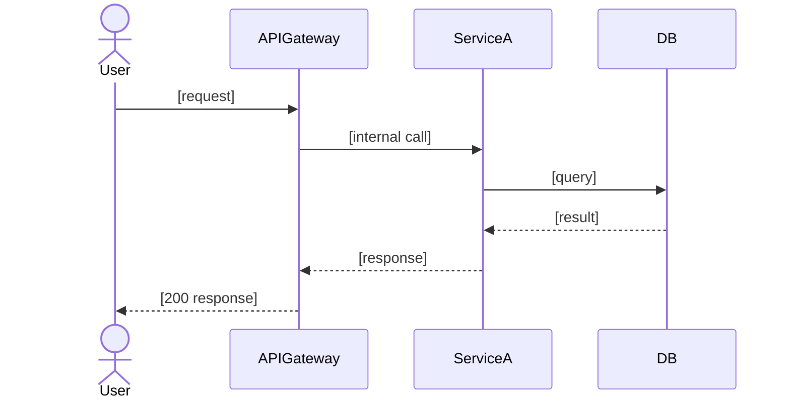

# Tech Lead — Output Templates
<!-- Read by Tech Lead at artifact-write time only. Not loaded on every dispatch. -->

## E2E Spec Mandate

`engineering-spec.md` covers the **full vertical slice** — every layer affected. Mark sections "N/A — not affected" rather than omit.

Required 14 sections (Engineering BR verifies all present + non-empty or explicitly N/A):

1. Problem Statement
2. System Context (mermaid)
3. User Flows Covered
4. API / Interface Contracts
5. Data Layer (schema + migrations)
6. Business Logic
7. Frontend (or N/A)
8. Mobile (or N/A)
9. Infrastructure (or N/A)
10. Deployment
11. Rollback
12. Monitoring & Alerting
13. Security
14. Testing

## `engineering-spec.md` template

```markdown
# Final Engineering Spec
**Spec ID:** [id]
**Version:** [N]
**Status:** DRAFT | REVISED | APPROVED

---

## 1. Problem Statement
[3–5 sentences: what is broken/missing, who is affected, business impact, why this approach over alternatives.]

---

## 2. System Context

```mermaid
graph TD
    %% Every component touched + immediate neighbours. Show data flows.
```

---

## 3. User Flows Covered

| Persona | What changes | Primary ACs |
|---------|--------------|-------------|
| [End User] | [concrete change] | AC-1, AC-3 |
| [Admin] | [concrete change] | AC-4 |

---

## 4. API / Interface Contracts

| Endpoint | Method | Auth | Description |
|----------|--------|------|-------------|
| `/api/[path]` | POST | JWT | [what it does] |

#### `[METHOD] /api/[path]`
**Request:**
```typescript
interface [RequestType] {
  [field]: [type]  // [description, constraints]
}
```
**Response (200):**
```typescript
interface [ResponseType] {
  [field]: [type]
}
```
**Errors:**
| Status | Code | Condition | Message |
|--------|------|-----------|---------|
| 400 | INVALID_INPUT | [exact] | [user message] |
| 401 | UNAUTHORIZED | [exact] | [user message] |
| 500 | INTERNAL | [exact] | [user message] |

---

## 5. Data Model

### New Tables / Collections
```sql
CREATE TABLE [name] (
  [column] [type] NOT NULL,
  PRIMARY KEY ([col]),
  INDEX idx_[name] ([col])
);
```

### Schema Migration
```sql
-- Safe under concurrent writes:
ALTER TABLE [name] ADD COLUMN [col] [type];
UPDATE [name] SET [col] = [default] WHERE [col] IS NULL LIMIT 1000;
ALTER TABLE [name] ALTER COLUMN [col] SET NOT NULL;
```

---

## 6. Architecture

### Component Interactions


### Error Flow
```mermaid
sequenceDiagram
    %% Key error paths — auth failure, service down, DB timeout
```

### Non-Negotiables
| Constraint | Failure if violated | Enforcement |
|------------|---------------------|-------------|

### Rejected Options
| Option | Why rejected |
|--------|--------------|

---

## 7. Error Handling

| Scenario | Layer | Error code | User message | Internal action |
|----------|-------|------------|--------------|-----------------|

---

## 8. Security

| Concern | Mitigation | Where enforced |
|---------|-----------|----------------|
| Auth bypass | [how] | [middleware / test TC-N] |
| Data isolation | [query filter] | [service / test TC-N] |

---

## 9. Performance

| Metric | Requirement | Baseline | Expected |
|--------|------------|----------|----------|
| p99 latency | [< Nms] | [Nms] | [Nms] |

**Cache:** [what is cached, TTL, invalidation trigger]

---

## 10. Observability

| Metric | Type | Description | Alert threshold | Severity |
|--------|------|-------------|-----------------|----------|

### Runbook: [AlertName]
**Trigger:** [exact]
**First response:** [step-by-step]
**Escalation:** [who, after how long]

---

## 11. Rollback

### With Feature Flag
```bash
[flag_tool] disable [flag_name] --env production --reason "[incident id]"
```

### Without Feature Flag
```bash
git revert [sha] && git push origin main && [deploy command] --env production
```

**Rollback tested in staging:** [ ] Yes  [ ] No — must be YES before prod

---

## 12. Test Coverage by User Flow

| User Flow | ACs | Test sections | Total tests |
|-----------|-----|---------------|-------------|

Full test cases: `.brocode/[id]/test-cases.md`

---

## 13. Pre-Deploy Checklist
- [ ] Schema migration tested on staging data volume
- [ ] Feature flag configured (if applicable)
- [ ] All metrics instrumented and visible in staging
- [ ] Alerts configured and tested
- [ ] Rollback procedure tested in staging
- [ ] Dependent on-calls notified: [list]

---

## 14. Implementation Notes
[Gotchas, non-obvious dependencies, order-of-operations.]

---

## 15. Executable Code Changes

For every task in `tasks.md`, populate the following block. Skip per-task only if the task is marked `N/A — design-only` with reason.

### Task <N>: <title>
**Domain:** backend | web | mobile | infra | qa
**Files touched:**
- `path/to/file.ext` — new | modify | delete

**Function signatures:**
```<lang>
function authenticateUser(req: Request): Promise<Session>
```

**Pseudo-diff:**
```diff
- if (token.expiry < now)
+ if (token.expiry <= now)
```

**Call sites to update:**
- `path/a.ext:42` — pass new arg
- `path/b.ext:88` — handle new return shape

**Test stub:**
```<lang>
test('rejects expired token at exact expiry', () => { ... })
```

**Acceptance:** <one-line measurable outcome>

### Rules

- Pseudo-diff is a sketch, not a full file. Show changed lines plus 2 lines of context.
- Test stub references behavior, not implementation. Failing test first (TDD-aligned).
- Call-site list is collected via grep during synthesis. A stale spec is a bug.
- If the task is `N/A — design-only`, replace the block with `_N/A — design-only: <reason>_`.

---

## References
- Requirements: `.brocode/[id]/product-spec.md`
- Implementation Options: `.brocode/[id]/implementation-options.md`
- Ops: `.brocode/[id]/ops.md`
- Test Cases: `.brocode/[id]/test-cases.md`
```

## `tasks.md` template

```markdown
# Implementation Tasks
**Spec ID:** [id]
**Status:** 0 / N complete

---

## Backend Tasks

### TASK-BE-01: [Title]
**Domain:** backend
**Status:** [ ]
**Depends on:** none
**Satisfies AC:** AC-3, AC-5
**Effort:** [S | M | L | XL]

**Files:**
- Create: `src/api/auth/token.ts`
- Modify: `src/api/routes.ts:45-52`
- Test: `tests/api/auth/token.test.ts`

**Implementation:**
- Endpoint: `POST /api/auth/token`
- Handler: `async function handleTokenRequest(req: Request): Promise<TokenResponse>`
- Validates: `{ code: string, redirect_uri: string }` — 400 if missing
- Returns: `{ access_token, refresh_token, expires_in }`
- Errors: 400 bad request, 401 invalid code, 500 internal

**Test cases from QA:**
- Happy path: valid code → tokens returned
- Invalid code → 401
- Missing redirect_uri → 400

---

## Web Tasks

### TASK-WEB-01: [Title]
[same structure]

---

## Mobile Tasks

### TASK-MOB-01: [Title]
[same structure]

---

## Infrastructure Tasks

### TASK-INFRA-01: [Title]
**Domain:** infrastructure
**Files:**
- Modify: `infra/terraform/...` or `k8s/...` or `.github/workflows/...`
**Implementation:** [exact infra change, env vars, secrets, resources]

---

## QA Tasks

### TASK-QA-01: [Title]
**Domain:** qa
**Files:**
- Modify or Create: `tests/...`
**Implementation:** [exact test cases, runner commands, assertions]
```

**Quality bar:**
- Zero vague tasks — "implement the auth flow" is not a task
- Every task maps to ≥ 1 AC
- Exact file paths + concrete function signatures
- Dependencies explicit — no implicit ordering
- Every task has `**Effort:**` — S (< 1h, 1–2 files) · M (1–3h) · L (3–8h) · XL (8h+, breakdown first)
- Every task has `**DoD:**` for non-default Definition of Done items. Default baseline: tests pass · commit exists · no TODO/FIXME in diff. List extras only:
  ```markdown
  **DoD:**
  - [ ] feature flag wired and tested off
  - [ ] API contract matches engineering-spec.md section 4
  ```
- Migration tasks MUST add to `**DoD:**`: down migration written + tested · tested on staging data volume · safe under concurrent writes (no full-table lock) · rollback tested in staging
- Every domain section present — Backend / Web / Mobile / Infrastructure / QA. Mark "N/A — not in scope" if no tasks.

## `investigation.md` template (investigate mode)

```markdown
# Investigation Report
**Investigation ID:** [id]
**Version:** [N]
**Status:** DRAFT | REVISED | APPROVED
**Domain(s):** [Backend | Frontend | Mobile | Cross-domain]

## Symptom
[Exact error / behavior]

## Reproduction
[Exact steps, commands, state]
[Reproducibility: always / flaky N% / condition X]

## Domain Trace
### [Domain 1]
[Component → Component, what enters/exits/breaks at each boundary]

## Evidence
[Logs, stack traces, metrics — verbatim]

## Root Cause
**Root cause:** [One precise sentence]
**Owning domain:** [Backend | Frontend | Mobile]
**Evidence:** [What proves this]
**Alternatives ruled out:** [Why not X, why not Y]

## SWE Debate Summary
[Key cross-domain exchanges]

## Impact
- Blast radius: [what else affected]
- Data integrity: [corruption/loss]
- User impact: [who, how many, since when]

## Proposed Fix
```diff
// Exact file:line diff — from owning domain engineer
```

## Test Case
```[lang]
// Failing test that proves the bug before fix
```

## Changes from BR Challenge
[Added on revision]

## Handoff
**Role:** tech-lead
**Status:** DONE | DONE_WITH_CONCERNS | NEEDS_CONTEXT | BLOCKED
**Task:** investigation.md
**Files changed:**
- `.brocode/<id>/investigation.md`
**Tests run:** [test command from wiki] → [N/N pass | no tests applicable]
**Risks:** [or "none"]
**Decisions:** [D-NNN refs or "none"]
**Next:** TPM — route to Engineering BR

## Conversation Entry (if any user interaction occurred this dispatch)
[per skills/brocode/modes/_shared/conversation-logging.md — omit if none]
```

## `implementation-options.md` template (spec mode)

```markdown
# Implementation Options
**Spec ID:** [id]
**Version:** [N]
**Status:** DRAFT | REVISED | APPROVED
**Domains involved:** [list]

## SWE Debate Log
[Key exchanges between Backend/Frontend/Mobile that shaped the options]
[Disagreements that became explicit tradeoffs]

## Option A: [Name]
### Approach
[2–3 sentences]
### Backend implementation
```[lang]
// Real code sketch
```
### Frontend implementation (if applicable)
```[lang]
// Real code sketch
```
### Mobile implementation (if applicable)
```[lang]
// Real code sketch
```
### Pros
- [concrete]
### Cons
- [concrete]
### Complexity: [Low/Medium/High]
### Risk: [Low/Medium/High]

## Option B: [Name]
[same structure]

## Option C: [Name]
[same structure]

## Tech Lead Recommendation
**Recommended Option:** [X]
**Backend position:** [agree/disagree + reason]
**Frontend position:** [agree/disagree + reason]
**Mobile position:** [agree/disagree + reason]
**SRE input:** [ops feasibility + blast radius]
**Rationale:** [tied to requirements + design constraints]

## Changes from BR Challenge
[Added on revision]

## Handoff
**Role:** tech-lead
**Status:** DONE | DONE_WITH_CONCERNS | NEEDS_CONTEXT | BLOCKED
**Task:** implementation-options.md
**Files changed:**
- `.brocode/<id>/implementation-options.md`
**Tests run:** N/A — spec mode
**Risks:** [or "none"]
**Decisions:** [D-NNN refs or "none"]
**Next:** TPM — route to Engineering BR

## Conversation Entry (if any user interaction occurred this dispatch)
[per skills/brocode/modes/_shared/conversation-logging.md — omit if none]
```
