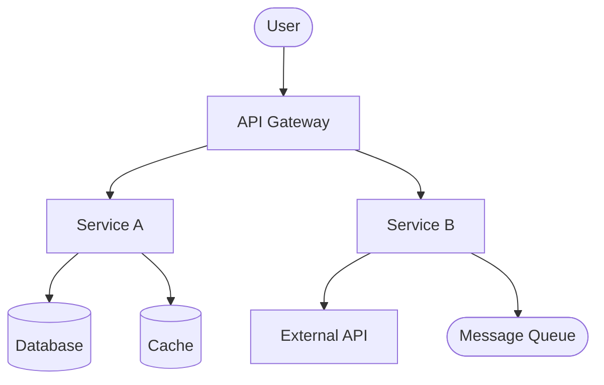
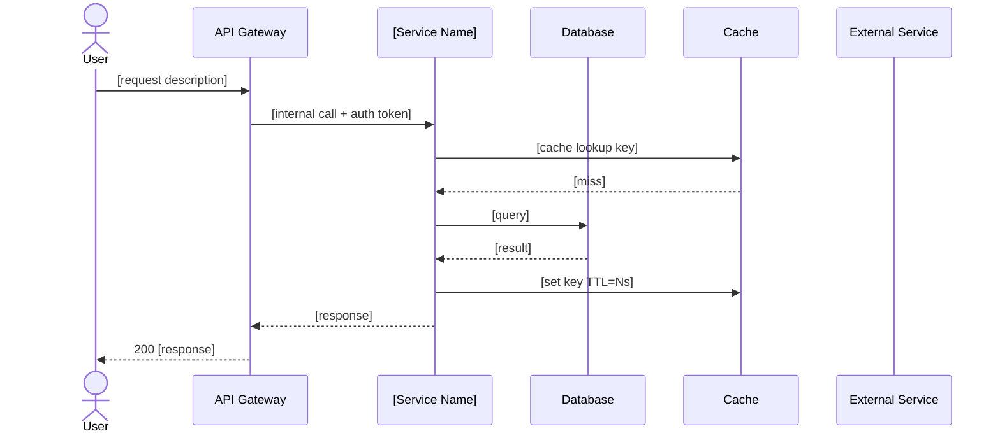
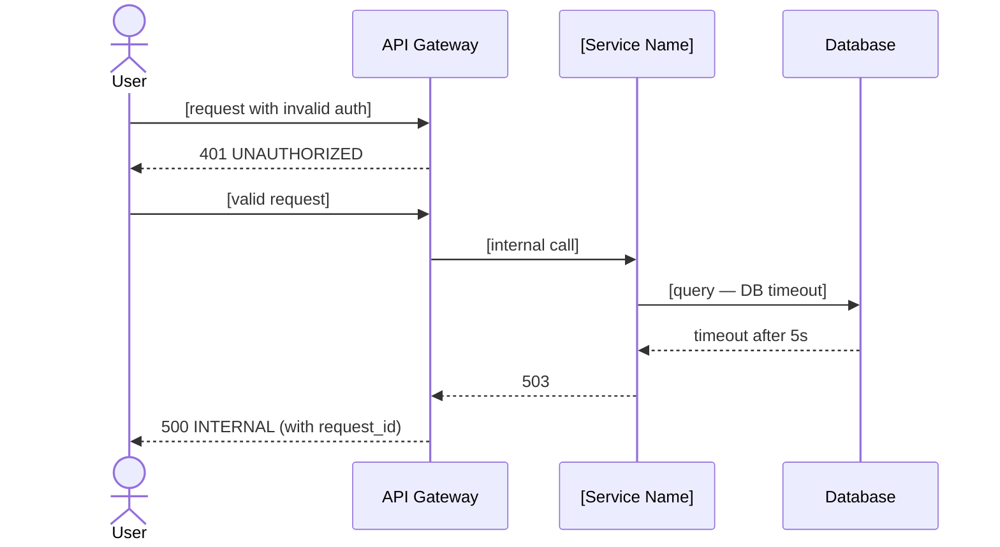

# Final Engineering Spec
**Spec ID:** [id]
**Version:** [N]
**Status:** DRAFT | REVISED | APPROVED

---

## 1. Problem Statement

[Full description: what is broken or missing, who is affected, what the business impact is, why this approach was chosen over alternatives. Minimum 3-5 sentences — not a one-liner. Include: the root problem, the personas affected, the metric impact, and the architectural decision rationale.]

---

## 2. System Context



---

## 3. User Flows Covered

| Persona | What changes for them | Primary ACs |
|---------|----------------------|-------------|
| [End User / Consumer] | [concrete change in their experience] | AC-1, AC-3 |
| [Merchant / Partner] | [concrete change] | AC-2 |
| [Admin / Ops] | [concrete change — what they can now monitor/configure] | AC-4 |
| [Support Team] | [concrete change — what they can now look up] | AC-5 |

---

## 4. API / Interface Contracts

| Endpoint | Method | Auth | Description |
|----------|--------|------|-------------|
| `/api/[path]` | POST | JWT Bearer | [what it does in one line] |
| `/api/[path]/:id` | GET | JWT Bearer | [what it does in one line] |

### `POST /api/[path]`

**Request:**
```typescript
interface [RequestType] {
  [field]: [type];  // [description, constraints — e.g., max 255 chars]
  [field]: [type];  // [required/optional, validation rules]
}
```

**Response (200):**
```typescript
interface [ResponseType] {
  [field]: [type];  // [description]
  [field]: [type];
}
```

**Errors:**
| HTTP Status | Error code | Exact condition | User-facing message |
|-------------|------------|-----------------|---------------------|
| 400 | INVALID_INPUT | [exact condition — e.g., field missing or > 255 chars] | "[exact message string]" |
| 401 | UNAUTHORIZED | [exact condition — e.g., token missing or expired] | "[exact message string]" |
| 403 | FORBIDDEN | [exact condition — e.g., user lacks role] | "[exact message string]" |
| 404 | NOT_FOUND | [exact condition] | "[exact message string]" |
| 409 | CONFLICT | [exact condition — e.g., duplicate] | "[exact message string]" |
| 500 | INTERNAL | [exact condition] | "An unexpected error occurred. Please try again." |

### `GET /api/[path]/:id`

**Request:** Path param `:id` — UUID string

**Response (200):**
```typescript
interface [ResponseType] {
  [field]: [type];
}
```

**Errors:**
| HTTP Status | Error code | Exact condition | User-facing message |
|-------------|------------|-----------------|---------------------|
| 401 | UNAUTHORIZED | token missing or expired | "[message]" |
| 404 | NOT_FOUND | id not found OR belongs to different tenant | "[message]" |

---

## 5. Data Model

### New Tables / Collections
```sql
CREATE TABLE [table_name] (
  id           UUID         NOT NULL DEFAULT gen_random_uuid(),
  tenant_id    UUID         NOT NULL,
  [col]        [type]       NOT NULL,
  [col]        [type],
  created_at   TIMESTAMPTZ  NOT NULL DEFAULT NOW(),
  updated_at   TIMESTAMPTZ  NOT NULL DEFAULT NOW(),
  PRIMARY KEY (id),
  INDEX idx_[table_name]_tenant_id (tenant_id),
  INDEX idx_[table_name]_[col] ([col])  -- reason: [why this index is needed]
);
```

### Modified Tables
```sql
-- Table: [existing_table]
-- Reason: [why modification needed]
ALTER TABLE [existing_table] ADD COLUMN [col] [type];
```

### Schema Migration
```sql
-- Migration: [migration_name]
-- Safe under concurrent writes (no full table lock):

-- Step 1: Add nullable column (instant, no lock)
ALTER TABLE [table] ADD COLUMN [col] [type];

-- Step 2: Backfill in batches (avoids long lock)
UPDATE [table] SET [col] = [default]
WHERE id IN (
  SELECT id FROM [table] WHERE [col] IS NULL LIMIT 1000
);
-- (Run until 0 rows updated)

-- Step 3: Add NOT NULL constraint (requires all rows filled)
ALTER TABLE [table] ALTER COLUMN [col] SET NOT NULL;

-- Rollback:
ALTER TABLE [table] DROP COLUMN [col];
```

**Migration risk:** [Low / Medium / High — table size, traffic level, lock duration]

---

## 6. Architecture

### Component Interactions (Happy Path)


### Error Flows


### Non-Negotiables
| Constraint | Failure scenario if violated | Enforcement |
|------------|------------------------------|-------------|
| [e.g., tenant isolation] | [data leak between tenants] | [query filter + test TC-04] |
| [e.g., idempotency on retries] | [duplicate records / double charge] | [idempotency key + DB unique constraint] |

### Rejected Options
| Option | Why rejected |
|--------|-------------|
| [Option B name] | [concrete reason tied to requirements or constraints] |
| [Option C name] | [concrete reason] |

---

## 7. Error Handling

| Scenario | Layer | HTTP status | Error code | User-facing message | Internal action |
|----------|-------|-------------|------------|--------------------|-----------------||
| Invalid input | API handler | 400 | INVALID_INPUT | "[message]" | Log WARN + request_id |
| Auth token missing | Middleware | 401 | UNAUTHORIZED | "[message]" | Log INFO |
| Auth token expired | Middleware | 401 | TOKEN_EXPIRED | "[message]" | Log INFO |
| Forbidden resource | Service | 403 | FORBIDDEN | "[message]" | Log WARN + user_id |
| Resource not found | Service | 404 | NOT_FOUND | "[message]" | Log DEBUG |
| DB timeout | Repository | 500 | INTERNAL | "An unexpected error occurred." | Log ERROR + stack trace + request_id |
| External API down | Service | 503 | SERVICE_UNAVAILABLE | "[message]" | Log ERROR + circuit breaker trigger |

---

## 8. Security

| Concern | Mitigation | Where enforced | Test |
|---------|-----------|----------------|------|
| Auth bypass | JWT validation on all routes | Auth middleware | TC-04 |
| Data isolation (multi-tenant) | `WHERE tenant_id = :tenantId` on all queries | Repository layer | TC-05 |
| Privilege escalation | Role check before mutation | Service layer | TC-06 |
| Injection (SQL) | Parameterized queries only | ORM / query builder | TC-07 |
| PII exposure | [field] masked in logs | Logger middleware | TC-08 |

---

## 9. Performance

| Metric | Requirement | Current baseline | Expected post-deploy |
|--------|------------|-----------------|---------------------|
| p99 latency ([endpoint]) | < [N]ms | [N]ms | [N]ms |
| p95 latency ([endpoint]) | < [N]ms | [N]ms | [N]ms |
| Throughput | [N] req/s sustained | [N] req/s | [N] req/s |
| DB query time | < [N]ms | [N]ms | [N]ms |

**Cache strategy:**
- Cached: [what is cached — key pattern]
- TTL: [N seconds / minutes]
- Invalidation trigger: [mutation event that busts the cache]
- Cache miss behavior: [fallback to DB, write-through, etc.]

---

## 10. Observability

| Metric name | Type | Description | Alert threshold | Severity |
|-------------|------|-------------|-----------------|----------|
| [metric_name] | counter | [description] | [threshold] | P0 / P1 / P2 |
| [metric_name] | histogram | [description] | [threshold] | P0 / P1 / P2 |

### Runbook: [AlertName]
**Trigger:** [exact condition — e.g., "error_rate > 5% for 2 minutes"]
**First response:**
1. `[exact command]` — [what to look for]
2. `[exact command]` — [what to look for]
3. [decision tree: flag disable vs. rollback]

**Escalation:** [who, after how long, via what channel]

---

## 11. Rollback

### With Feature Flag
```bash
[flag_tool] disable [flag_name] --env production --reason "[incident_id]"
[flag_tool] status [flag_name] --env production  # verify
```

### Without Feature Flag
```bash
git revert [sha] --no-edit
git push origin main
[deploy_command] --env production --sha $(git rev-parse HEAD)
[health_check_command]
```

### Data Rollback *(if migration involved)*
```sql
-- Reverse migration:
[exact SQL]
```

**Rollback tested in staging:** [ ] Yes  [ ] No — must be YES before prod deploy

---

## 12. Test Coverage by User Flow

| User Flow | ACs covered | Test sections | Total test cases |
|-----------|------------|---------------|-----------------|
| End User / Consumer | AC-1, AC-2, AC-3 | Happy path, Error paths, Edge cases, Security | [N] |
| Merchant / Partner | AC-4, AC-5 | Happy path, Error paths | [N] |
| Ops / Admin | AC-6 | Happy path | [N] |
| Support Team | AC-7 | Happy path | [N] |
| Cross-flow | AC-1+AC-4 | Cross-flow | [N] |

Full test cases: `.brocode/[id]/test-cases.md`

---

## 13. Pre-Deploy Checklist
- [ ] Schema migration tested on staging with production-scale data volume ([N] rows)
- [ ] Feature flag configured — default state: [enabled / disabled]
- [ ] All metrics instrumented and visible in [dashboard link / name]
- [ ] All alerts configured with thresholds tested by triggering in staging
- [ ] Rollback procedure tested end-to-end in staging — result: [passed / failed]
- [ ] Runbook written and linked from alert definition
- [ ] Dependent on-call teams notified: [team names]
- [ ] Load test passed: p99 < [N]ms at [N] req/s

---

## 14. Implementation Notes

[Gotchas, non-obvious dependencies, order-of-operations requirements. Things that would surprise a new engineer. Examples:]
- [e.g., "Migration step 2 must complete before deploying the service — service crashes if column missing"]
- [e.g., "Cache key includes tenant_id — do not omit or you'll serve cross-tenant data"]
- [e.g., "External API has a 10 req/s rate limit per tenant — add backoff or you'll 429 under load"]

---

## References
- Requirements: `.brocode/[id]/product-spec.md`
- Design: `.brocode/[id]/product-spec.md (section 15 UX flows)`
- Implementation Options: `.brocode/[id]/implementation-options.md`
- Ops: `.brocode/[id]/ops.md`
- Test Cases: `.brocode/[id]/test-cases.md`

---

## Changes from BR Challenge
[Added on each revision — address each BR challenge by number C1, C2, ...]
