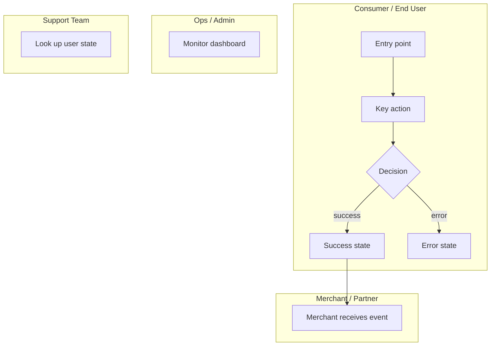
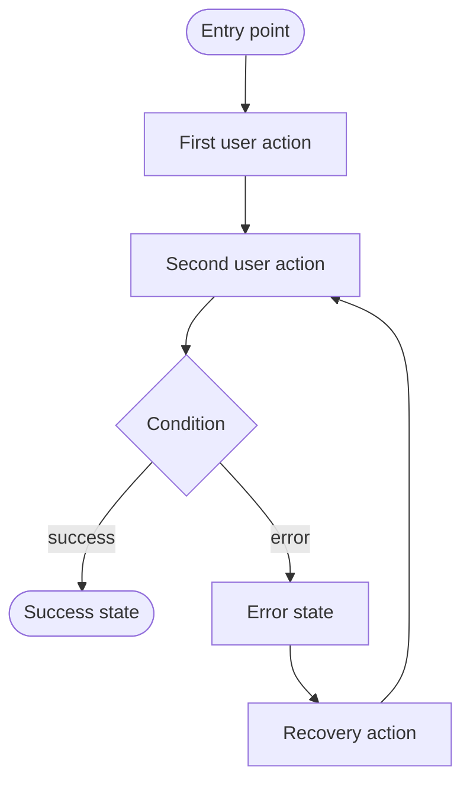
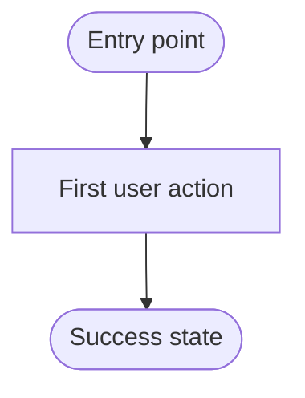
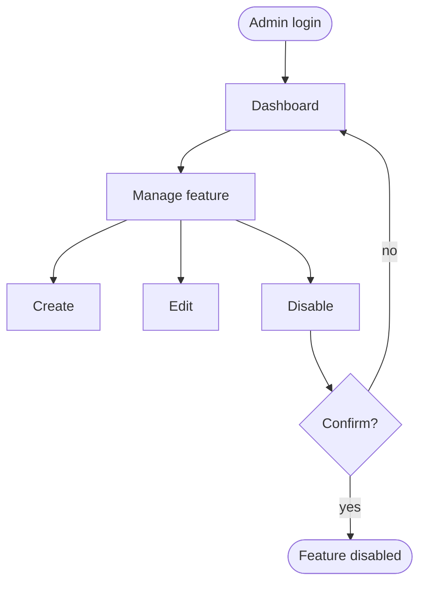

# UX / UI Design
**Spec ID:** [id]
**Version:** [N]
**Status:** DRAFT | REVISED | APPROVED

## End-to-End Flow

## Personas Covered
| Persona | Section |
|---------|---------|
| [Persona 1] | [Section name] |
| [Persona 2] | [Section name] |
| [Persona 3: Ops / Admin] | [Section name] |
| [Persona 4: Support Team] | [Section name] |

---

## [Persona 1: e.g., End User / Consumer]

### Happy Path: [Journey name from requirements]

#### Step-by-step
| Step | User action | What they see | System state |
|------|-------------|---------------|-------------|
| 1 | [action] | [screen / component description] | [background state] |
| 2 | ... | ... | ... |

### Error States
| Trigger | What user sees | CTA / Recovery |
|---------|---------------|----------------|
| Network error | [exact message copy] | Retry button |
| Session expired | [exact message copy] | Redirect to login |
| Invalid input | [exact inline validation message] | Field highlight + helper text |
| [Feature-specific error] | [exact message copy] | [action] |

### Empty States
| Context | What user sees | CTA |
|---------|---------------|-----|
| First-time use | [exact message + illustration hint] | [primary CTA] |
| No results | [exact message] | [suggest action] |
| Post-deletion | [exact message] | [undo / navigate away] |

### Loading / Async States
| Operation | Loading indicator | Duration threshold before showing | Timeout message |
|-----------|------------------|-----------------------------------|-----------------|
| Fetching list | Skeleton screen | 200ms | "Taking longer than expected…" |
| Submitting form | Button spinner + disabled | Immediate | [timeout message] |
| [Feature-specific op] | [indicator] | [Nms] | [message] |

---

## [Persona 2: e.g., Merchant / Partner]

### Happy Path: [Journey name from requirements]

#### Step-by-step
| Step | User action | What they see | System state |
|------|-------------|---------------|-------------|
| 1 | [action] | [screen / component description] | [background state] |

### Error States
| Trigger | What user sees | CTA / Recovery |
|---------|---------------|----------------|
| [error] | [exact message copy] | [action] |

### Empty States
| Context | What user sees | CTA |
|---------|---------------|-----|
| First-time use | [exact message] | [primary CTA] |

### Loading / Async States
| Operation | Loading indicator | Duration threshold | Timeout message |
|-----------|------------------|-------------------|-----------------|
| [operation] | [indicator] | [Nms] | [message] |

---

## [Persona 3: e.g., Ops / Admin]

### Admin Interface

#### Capabilities
| Action | Who can do it | UI surface | Confirmation required? |
|--------|--------------|------------|----------------------|
| [e.g., disable feature] | [role] | [where in UI] | Yes — modal with impact summary |
| [e.g., view audit log] | [role] | [where in UI] | No |
| [e.g., export data] | [role] | [where in UI] | No |

#### States & Feedback
| Trigger | What admin sees | CTA / Recovery |
|---------|----------------|----------------|
| [error] | [exact message copy] | [action] |

#### Empty States
| Context | What admin sees | CTA |
|---------|----------------|-----|
| No items | [exact message] | [primary CTA] |

#### Loading States
| Operation | Loading indicator | Duration threshold | Timeout message |
|-----------|------------------|-------------------|-----------------|
| [operation] | [indicator] | [Nms] | [message] |

---

## [Persona 4: e.g., Support Team]

### Support Interface

| Tool | What they can see | What they can do | What they cannot do |
|------|------------------|-----------------|---------------------|
| [support portal] | [user's state, recent actions, error codes] | [resend, reset state] | [cannot modify live data] |

#### Support Lookup Flow
| Step | Support action | What they see |
|------|---------------|---------------|
| 1 | Search by user ID / email | [user profile + feature state] |
| 2 | View audit trail | [timestamped action log] |
| 3 | Trigger resolution action | [confirmation + result] |

---

## Interaction Design Notes

### Notifications & Feedback
| Event | Channel | Message copy | Timing |
|-------|---------|-------------|--------|
| [e.g., action completed] | In-app toast | "[exact copy]" | Immediate |
| [e.g., async process done] | Push notification | "[exact copy]" | Within 1 min |
| [e.g., approval needed] | Email + in-app | "[exact copy]" | Immediate |

### Navigation & Information Architecture
[How this feature fits into existing nav. New entry points, deep links, back-navigation behavior.]

---

## Design Decisions
| Decision | Options considered | Chosen | Rationale |
|----------|--------------------|--------|-----------|
| [decision] | A: [option] / B: [option] | [chosen] | [why] |

## Consistency Check
### Patterns Followed
- [existing pattern this design matches]

### Deviations
- [deviation]: [justification — why breaking the pattern is justified]

## Competitor / Reference Patterns
[If PM referenced competitors: UX patterns worth adopting or explicitly avoiding]
[Product BR will validate these via web research]

## Open Questions for Engineering
| Question | Who to ask | Blocks |
|----------|-----------|--------|
| [question] | Backend / Frontend | [what it blocks] |

## Changes from BR Challenge
[Added on each revision — address each BR challenge by number C1, C2, ...]
